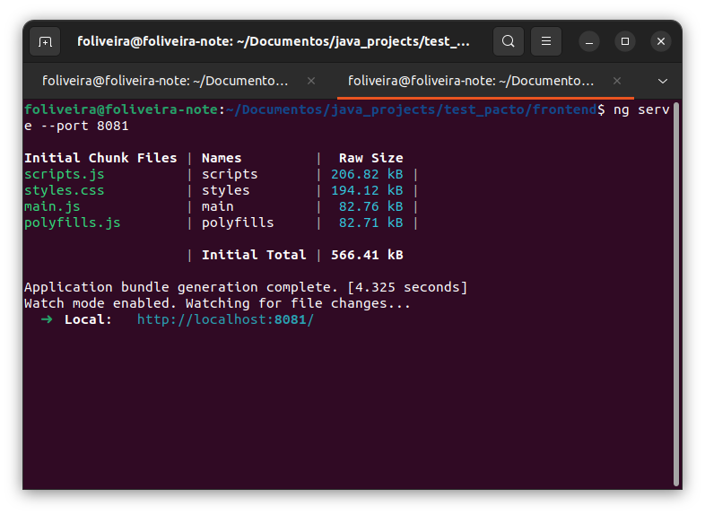
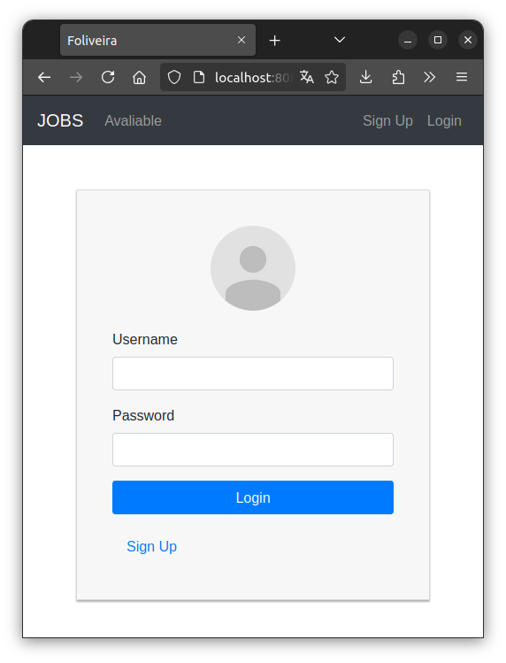
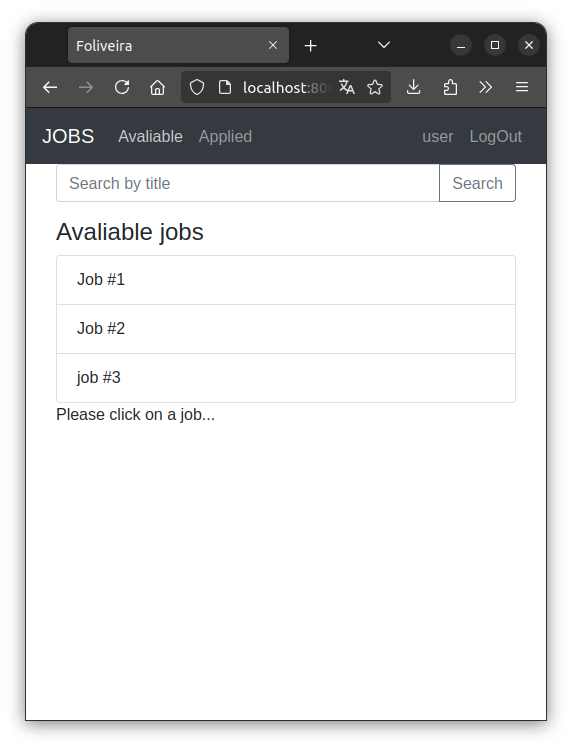
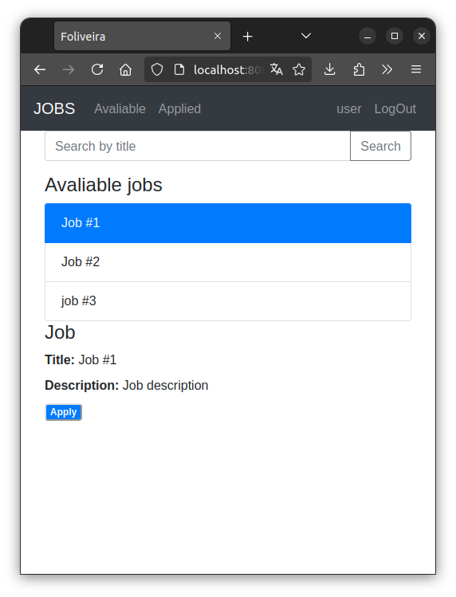
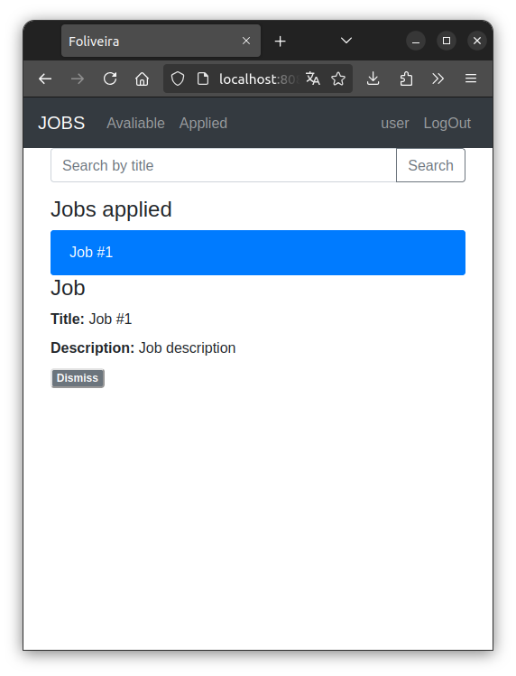

# aplicação web para o processo de recrutamento interno
Este projeto é parte de um Desafio Técnico para Desenvolvedor Full Stack. Esta parte é referente ao frontend da aplicação, sendo necessária para sua correta execução configurar e executar o backend, podendo ser encontrado [neste repositório](https://github.com/FelipOliveira/test_pacto_backend)

Para executar esta aplicação serão necessários:

- Angular CLI 18
- npm 10.7.0
- nodeJS v18.20.4

## Configurando e executando
Abra o terminal no mesmo diretório da aplicação e digite o comando `npm install`. Após todas as dependências necessárias serem instaladas digite o comando `ng serve --port 8081` e a aplicação estará disponível no navegador pela url `localhost:8081`.

Ao abrir a aplicação pela primeira vez será exibida a tela de login e após esta etapa será mostrada a tela principal.

A tela principal do menu "Avaliable" mostra uma lista com as vagas disponíveis para o usuário, podendo clicar em cada uma delas para ver seus detalhes e, caso desejar, se candidatar. Uma vez que o candidato se candidatou a vaga ela pode ser vista no menu "Applied".

É possível retirar a candidatura clicando no botão "dismiss".

## Administrador
Ao logar com permissão de admistrador, o usuário tem acesso a opções extras como criar novas vagas, editar vagas existentes e deletar vagas encerradas
